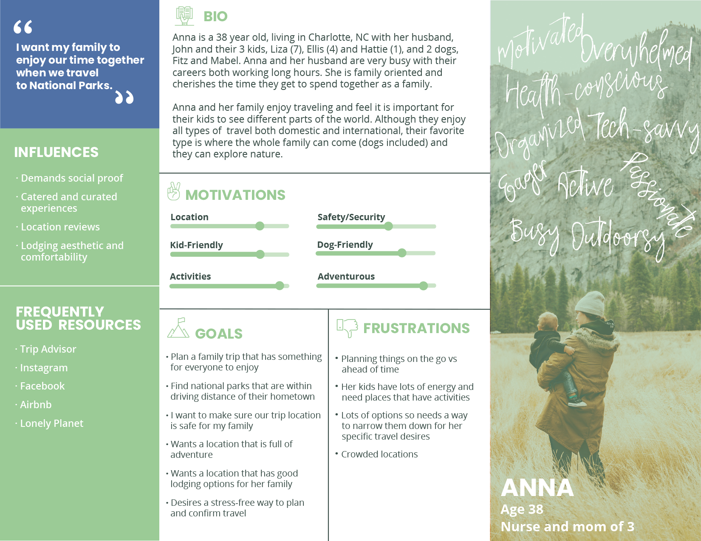
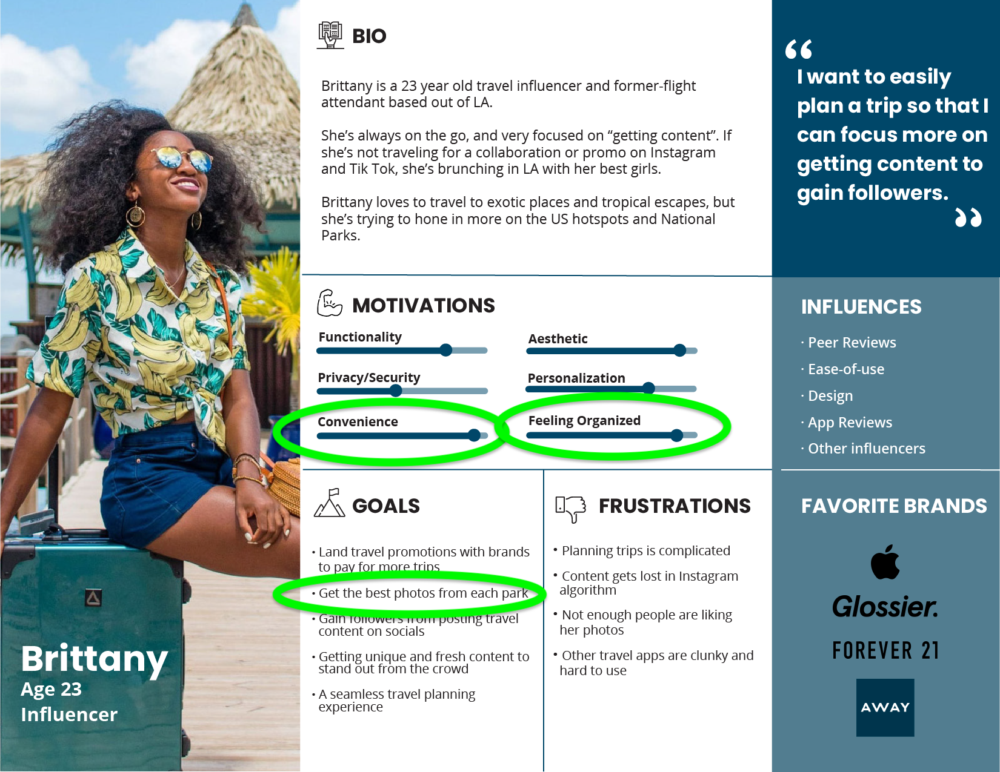
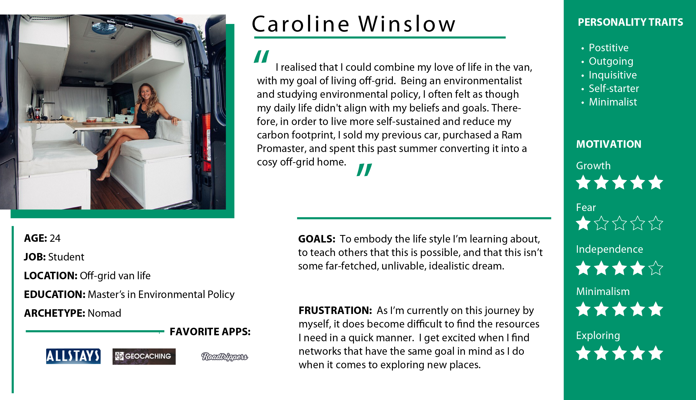
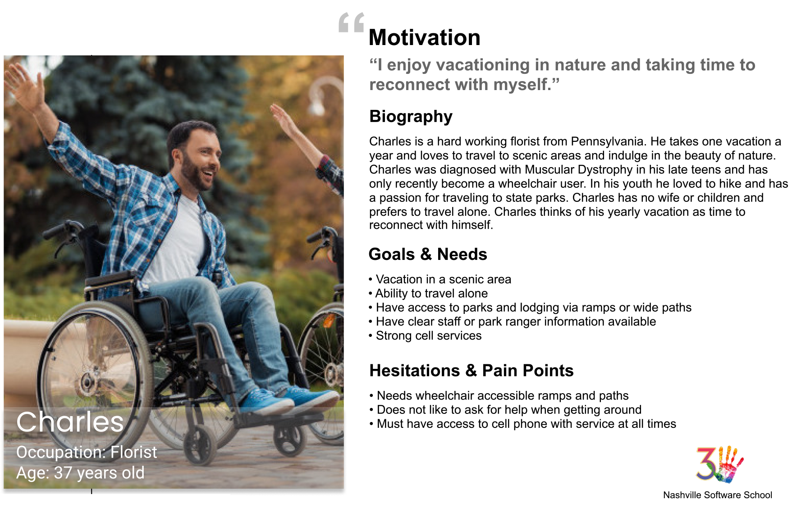
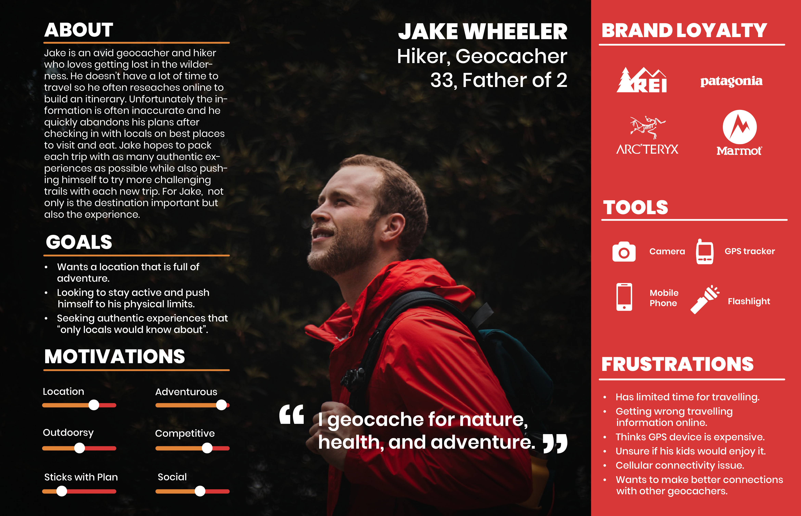

# Holiday Road from Nashville

You and your teammates have been contracted by the National Parks Service to build an application that will allow people to plan excursions for trips to our country's beautiful national parks. The starting point of each trip will be Nashville, TN with a national park destination and two other stops along the way. The additional stops will include one bizarrary and one Eatery.

You are creating this app for a specific type of user. Choose one of the personas below as your target. Refer back to the persona when making choices about layout, content hierarchy, and usability. 

## Getting Started

This is going to be your first full, professional Sprint. A Sprint is part of the [Scrum Framework](https://en.wikipedia.org/wiki/Scrum_%28software_development%29) for agile development. 
1. You will be doing daily scrum stand-ups, where you provide a **concise** status update on your own work. 
1. You will be taking part in a sprint review where you demonstrate the work you have completed. 
1. You will be taking part in a retrospective, where the team reflects on the work done, the team dynamics, and discuss how to improve in the future.

### Code Review

During this sprint, the focus will be on learning, much more than doing. We estimate that most teams could get this project done in 2-3 days. We are giving you 5.

To accomplish maximum learning, the following requirement is placed on the team, and will be monitored by your team lead. All PRs should use the `pull_request_template.md` provide in the repo. When a teammate submits a PR, and you are ready to review it, then you and the submitter must sit together and review all of the code that was written and included in the PR. Also, if any other teammates would like to review the code, then you must include them on the review, too.

Only when you feel you understand all of the code, then you may complete the testing of the feature and provide approval for merging.

### Settings

After each teammate clones the repository, each member must perform the following steps.

1. In the `scripts` directory, you will see a file named `Settings.js.example`.
1. Copy that file with `cp Settings.js.example Settings.js`. The `Settings.js` file is already in the `.gitignore` file, so it won't ever be tracked by git.
1. Make a copy of the `db.json.example` file in the `api` directory without the `.example` extension: `cp db.json.example db.json`. The `db.json` file is already in the `.gitignore` file, so it won't ever be tracked by git.
1. Register an API key for the APIs below that need it.
1. Copy your key into the appropriate place in the `Settings.js` file.
1. The team will need to figure out how to import that object into the data manager modules and use it for the `fetch()` calls that need to be performed.

**_DO NOT MODIFY Settings.js.example OR db.json.example during this project!!!_**

## Feature List

### Building the Trip

* User should be able to select a state and then you will list all national parks for that state in a dropdown. When user chooses one, display the name of the park in the **Trip Preview** section.

* List all bizarraries in a dropdown. When user chooses one, display the name of the bizarre attraction in the **Trip Preview** section.

* List all eateries in a dropdown. When user chooses one, display the name of the eatery in the **Trip Preview** section.

### Trip Details

* In the **Trip Preview** section, there should be a button labeled _Save Trip_. It should be disabled by default.
* Once a user has selected a park, and the name of the park has been added to the **Trip Preview** section, query the Open Weather API and display the 5 day forecast for that location. This will allow the user to see if they want to make the trip soon.
* When the user adds any item to the **Trip Preview**, there should be a _Details_ button next to the name of the item.
* When the user selects any detail button for an trip item, a dialog box should be presented to the user with more information about that item _(description, address, etc...)_.
* Once the user has selected a park, a bizarre attraction, and an eatery, the _Save Trip_ button should be enabled.
* When the user clicks the _Save Trip_ button, the chosen items should be saved as an object in your own, local API that is managed by `json-server`. Each saved trip should appear in an aside bar on the side of the UI.

### README.md
You will need a complete `README.md` for this project. Be sure to include a screenshot of your ERD and Wireframe and listing of team members. 
* [README Materials](https://github.com/nss-day-cohort-51/client-side-mastery/blob/main/book-2-giffygram/chapters/Project-Readme.md)

## Personas
| [Anna](./personas/persona-anna.png) | [Betsy](./personas/persona-betsy.png) | [Brittany](./personas/persona-brittany.png) | [Caroline](./personas/persona-caroline.png) | [Charles](./personas/persona-charles.png) | [Jake](./personas/persona-jake.png) | [Peter](./personas/persona-peter.png)
| -- | -- | -- | -- | -- | -- | -- |
| | |  |  |  |  | 

### Stretch Goal: Directions

Only after the main features of the application listed above are complete and your have your team lead approval, you can work on the stretch goal of providing directions. For this feature, you will be using the Graphhopper API.

Once the user has saved a trip, and it is listed in the aside bar, refactor your application to add a _Get Directions_ button to each HTML representation of the trip. When the user clicks that button for a trip, the user should be presented with step-by-step instructions for the trip. It should include

* All 4 locations _(Nashville, bizarrerie, eatery, and national park)_ need to be sent to Geocoding API to the the latitude and longitude for each one.

* Then all 4 lat/long pairs should be in the URL for the request to the Routing API.
* The step-by-step instructions in the response from the Routing API should be displayed below the **Trip Preview** section.

### Stretch Goal: Multiple Bizarreries and Eateries

For this stretch goal, the user can still only pick one national park as the destination, but multiple bizarreries, and multiple eateries can be chosen as waypoints along the way.

### Stretch Goal: Park Events

Add a button to a saved trip labeled _Events_. When the user clicks the button, query the NPS API to get the first two events _(use the `limit` query parameter)_ for that park. Then display the following data in a dialog box.

* title
* dateStart
* timeStart
* timeEnd
* description
* feeInfo

### Stretch Goal: Search

Add a **`UserSearch`** component to your application where the user can type in any search string, and you would find anything that matches in...

1. Your local trip API
1. National Park Service API
1. Bizarreries API
1. Eateries API

Display all matching items in a **`SearchResults`** component. Each item in the search results would have a button next to it that would allow the user to add that item to their trip preview.

## API Keys

All API keys should be added to `Settings.js`. Once again, **_DO NOT MODIFY Settings.js.example!_**

## Accessing the API keys

In any module where you need your API keys,

```js
import { settings } from "./Settings.js"

// Since settings is an object, you can use dot notation or square bracket notation to access the properties.
settings.npsKey
settings["weatherKey"]
```


## National Park Service API

* API home: https://www.nps.gov/subjects/digital/nps-data-api.htm
* API documentation: https://www.nps.gov/subjects/developer/api-documentation.htm

## Weather API

https://openweathermap.org/api

## Bizarre Destination

http://holidayroad.nss.team/bizarreries

## Eateries Destination

http://holidayroad.nss.team/eateries

## Graphhopper API

1. Register at https://graphhopper.com/dashboard/#/register
1. Once you are authenticated, visit your dashboard at https://graphhopper.com/dashboard/#/overview
1. Request an API key at https://graphhopper.com/dashboard/#/api-keys

### Get Coordinates of Place

#### Request

https://graphhopper.com/api/1/geocode?q=yosemite+national+park&locale=us&debug=true&key=your_api_key

#### Example Response

```json
{
    "hits": [
        {
            "osm_id": 1643367,
            "osm_type": "R",
            "extent": [
                -119.8861004,
                38.1863499,
                -119.1995075,
                37.4946797
            ],
            "country": "United States of America",
            "osm_key": "leisure",
            "housenumber": "PO box 577",
            "street": "Mt. Hoffmann Trail",
            "osm_value": "nature_reserve",
            "postcode": "95389",
            "name": "Yosemite National Park",
            "state": "California",
            "point": {
                "lng": -119.51658779802511,
                "lat": 37.84054795
            }
        }
    ],
    "took": 24
}
```

### Get Directions

Once you have the coordinate of a place, you can get directions to it. The first `point` query parameter below is the origin, and the last is the destination. If you have more than waypoint along the way, keep adding points, but always make sure origin is first and destination is last.

https://graphhopper.com/api/1/route?point=starting_latitude,starting_longitude&point=destination_latitude,destination_longitude&vehicle=car&locale=us&instructions=true&calc_points=true&key=your_api_key"

## Remember These Tips For A Good Usable Website
1. Use acceptable conventions
   * Logo positioned at top left
   * Navigation across the top or down the left side
   * Copyright in the footer.
2. Visual hierarchy
   * Most important information is the most prominent
3. Break pages up into defined sections
   * Logically related content should be related visually
4. That which is clickable should be obviously clickable.
5. Eliminate distractions
   * Use only two typefaces
   * Limit color pallet (3 colors with black and white)
   * Use a grid
6. Support scanning (users don't read)
   * Use plenty of headings
   * Short paragraphs
   * Bulleted lists
   * Left aligned text
7. Strive for consistency.
8. Use semantic and valid HTML: validator at [https://validator.w3.org/](https://validator.w3.org/).

